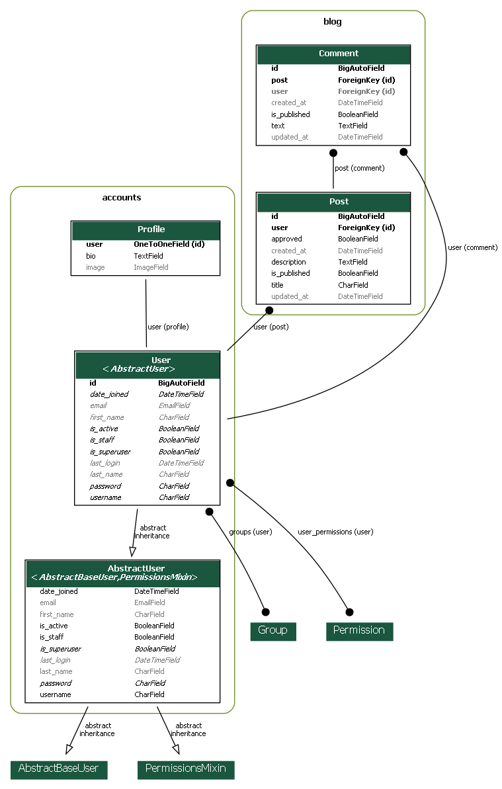

# Blog_HW
python version 3.11.3

Blog post web app.


#  for windows
### instead of gunicorn
```
pip install waitress
```
* #### run
```
waitress-serve --listen=127.0.0.1:8000 core.wsgi:application
```
### for celery

```
 pip install gevent
```
* #### run
```
celery -A core worker -l info -P gevent
```
